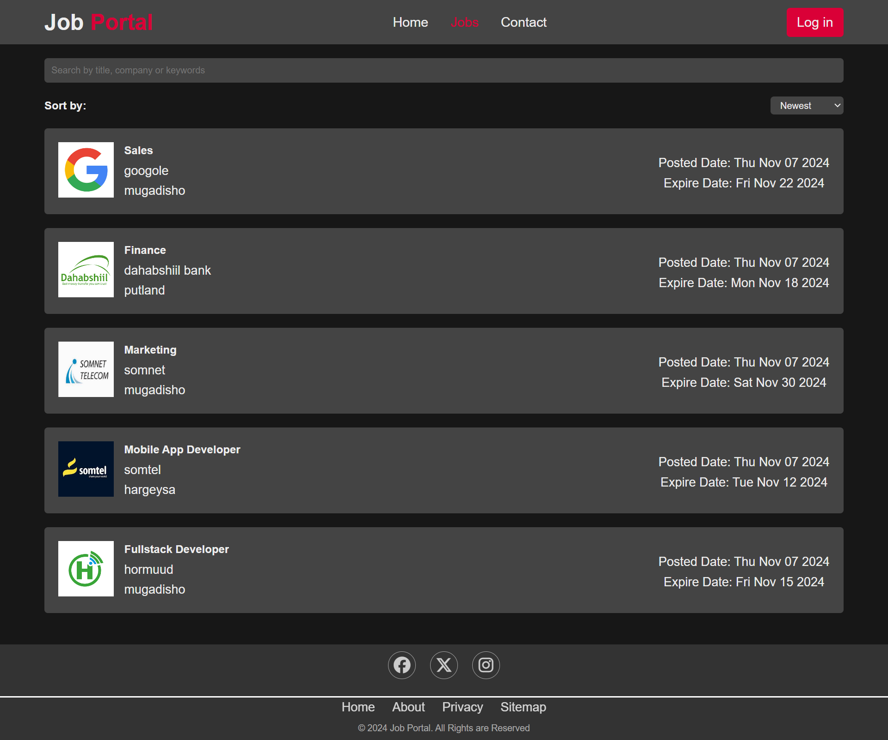

# Job Portal


## Description

Job Portal is a web application that connects job seekers with employers. It provides a platform for users to search and apply for jobs, while allowing employers to post job listings and manage applications. The project features a responsive design and enhanced user experience.

## Problem Statement
Problem: The fast-paced job market presents challenges like information overload, time-consuming processes for employers, lack of centralization, poor user experience, and limited accessibility on existing job portals.

## Solution Statement
Solution: Our Job Portal offers an efficient job search with powerful filters, a streamlined application process, a centralized platform for job seekers and employers, responsive design for all devices, accessibility features including  a comprehensive admin dashboard for managing postings and applications, and local storage for smoother user experience. This aims to simplify and improve the job search and hiring process for all parties involved.

## Website Demo

You can view a live demo [Live Demo here](https://job-portal11.vercel.app).

To access the demo, you can use the following credentials:
- Admin User:
  - Username: admin@gmail.com
  - Password: admin12

Please note that the demo is reset periodically, and any changes made will not be permanent.

## Members
### Team 2 Of Group C 

- Ayanle Osman
- Abdihakim Adan

## Screenshots

### LOG IN Page

### Admin Page

### Jobs Lists Page


## Code Snippets

Here are some key code snippets from the Job Portal project:

### posting Job To the Facebook Using  API

This JavaScript code handles posting Job To the Facebook :

```javascript
  const url = `` ; //API KEY


        console.log(url);

        const options = {
            method: 'POST',

            body: JSON.stringify({
                JobTitle: postTitle.value,
                HiringCompany: companyInput.value,
                JobImage: imageUrl.value
            })

        };

        console.log(options);
        try {
            const response = await fetch(url, options);
            const result = await response.json();
            console.log(result);


        } catch (error) {
            console.error(error);
        }
```

## Features

- User authentication (sign up, login, logout)
- Job search functionality
- Job listing page with detailed job information
- Apply to jobs feature
- Admin dashboard for managing jobs and users
- Responsive design for mobile and desktop
- API for posting job to the Facebook


## Technologies Used

- HTML5
- CSS3
- JavaScript (ES6+)
- Local Storage for data persistence
- Font Awesome for icons
- Chart.js for admin dashboard visualizations
- API for posting job to the Facebook

## Installation

1. Clone the repository:
   ```
   git clone https://github.com/dugsiiyeinc/Job-Portal.git
   ```

2. Navigate to the project directory:
   ```
   cd job-portal
   ```

3. Open the `index.html` file in your web browser to view the project locally.

## Usage

1. Open the application in your web browser.
2. Sign up for a new account or log in if you already have one.
3. Browse job listings on the Jobs page.
4. Use the search functionality to find specific jobs.
5. Click on a job to view more details and apply.
6. If you're an admin, access the admin dashboard to manage jobs and users.


## Contributing

Contributions are welcome! Please follow these steps to contribute:

1. Fork the project
2. Create your feature branch (`git checkout -b feature/AmazingFeature`)
3. Commit your changes (`git commit -m 'Add some AmazingFeature'`)
4. Push to the branch (`git push origin feature/AmazingFeature`)
5. Open a pull request

## Contact

- shiinedev - [shiinecadde17@gmail.com](mailto:shiinecadde17@gmail.com)
- Ayaanle - [ayaanleosman@gmail.com](mailto:ayaanleosman@gmail.com)

## Conclusion
- Thanks to the Dugsiiye Team and especially our teacher Mc hoamuda

